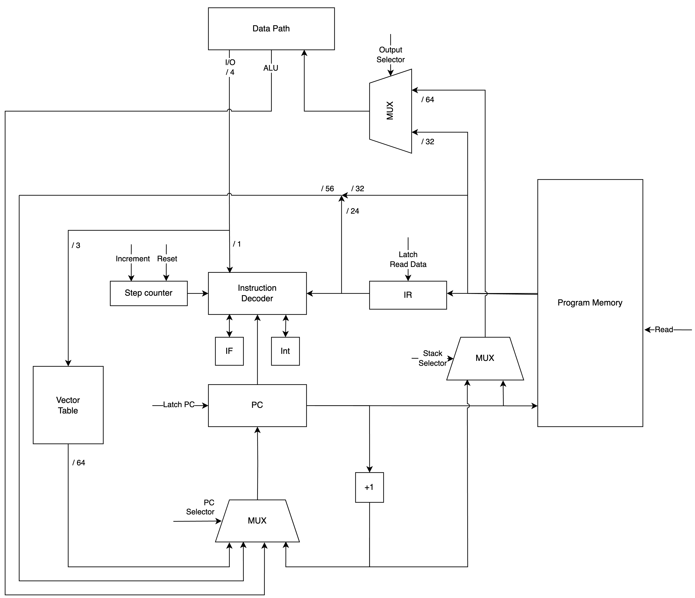
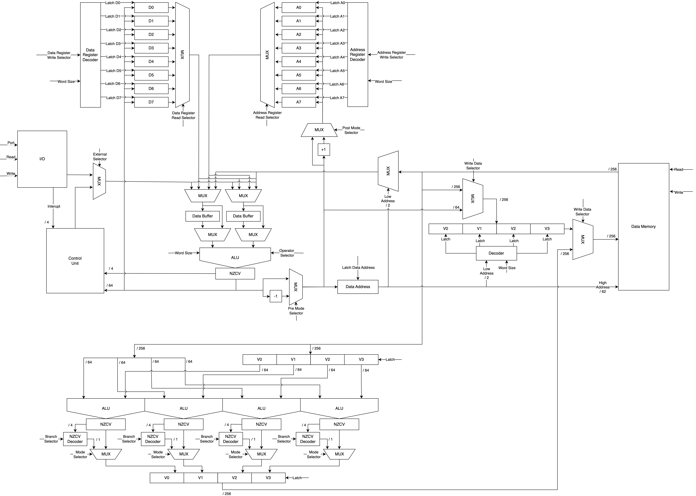
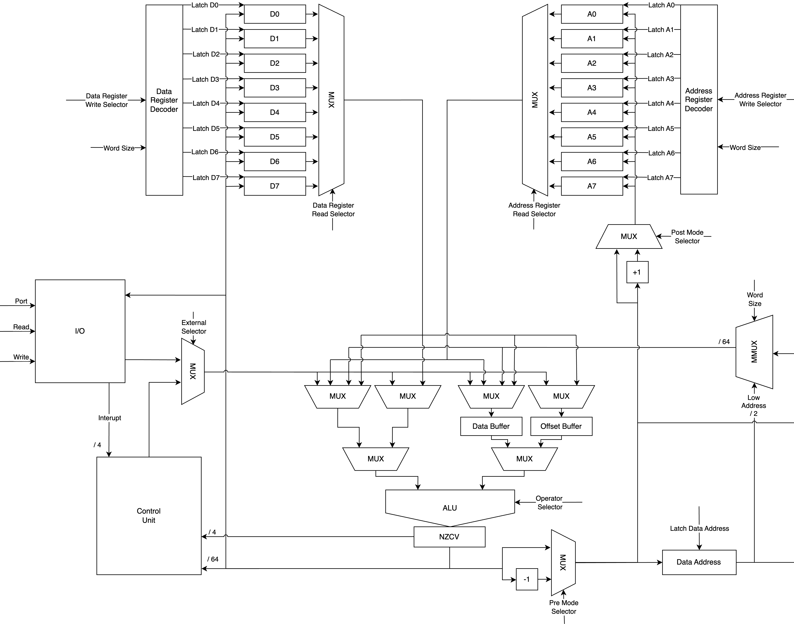
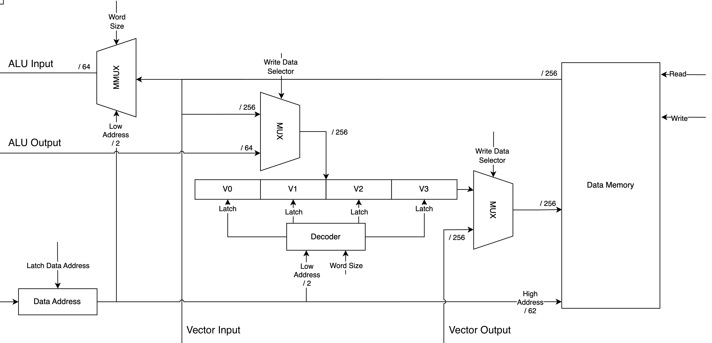
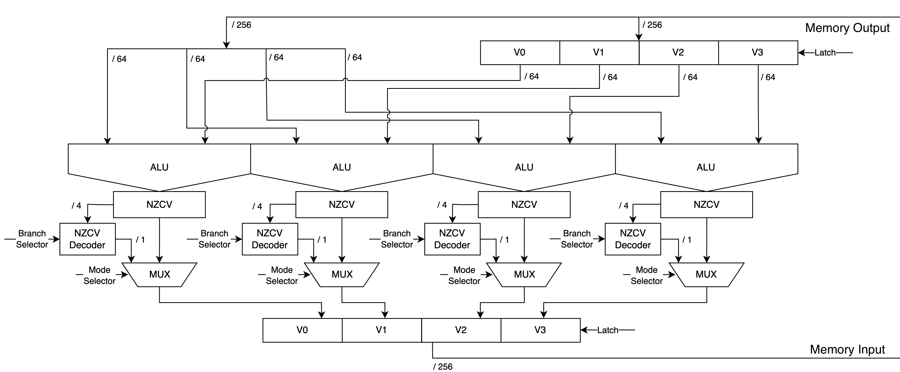

# Лабораторная работа №4

по дисциплине

«АРХИТЕКТУРА КОМПЬЮТЕРА»

Вариант:  
alg | cisc | harv | hw | tick | binary | trap | port | cstr | prob1 | vector

**Выполнил:**  
Софьин Вячеслав Евгеньевич,  
студент группы P3207

**Проверил:**  
Пенской Александр Владимирович

г. Санкт-Петербург, 2026

---

## Содержание

- [Алгоритмический язык](#алгоритмический-язык)
  - [Выражения](#выражения)
  - [Абстрактное синтаксическое дерево](#абстрактное-синтаксическое-дерево)
  - [Семантический анализ](#семантический-анализ)
- [Организация памяти](#организация-памяти)
  - [Описание архитектуры](#описание-архитектуры)
  - [Внешние устройства](#внешние-устройства)
  - [Использование памяти транслятором](#использование-памяти-транслятором)
- [Поток компиляции](#поток-компиляции)
- [Система команд](#система-команд)
  - [Инструкции с n операндами](#инструкции-с-n-операндами)
  - [Инструкции переходов](#инструкции-переходов)
  - [Описание операнда](#описание-операнда)
  - [Режим операнда](#режим-операнда)
  - [Коды операторов](#коды-операторов)
- [Взаимодействие с программой](#взаимодействие-с-программой)
- [Управляющее устройство](#управляющее-устройство)
- [Тракт данных](#тракт-данных)
- [Векторные операции](#векторные-операции)

---

## Алгоритмический язык

### Выражения

```typst
literal ::= number | string | char | "true" | "false" ;

binary-operator ::= "+" | "-" | "*" | "/" | "%"
          | "<<" | ">>"
          | "&" | "|" | "^"
          | "&&" | "||"
          | "==" | "!=" | "<" | "<=" | ">" | ">=" ;
          
assignment-operator ::= "=" | "+=" | "-="
          | "*=" | "/=" | "&=" | "|=" | "^=" ;
          
value ::= literal
          | identifier
          | "this"
          | "(" expression ")"
          | "new" identifier "(" ")"
          | "new" identifier "[" number "]"
          | "[" [ literal { "," literal } ] "]" ;
          
box ::= identifier
         | value "." identifier
         | value "[" expression "]"
         | value "[" expression ":" number "]" ;
         
expression ::= value { postfix-operator }
         | prefix-operator expression
         | expression binary-operator expression
         | box assignment-operator expression ;
         
prefix-operator ::= "-" | "!" | "~" | "++" | "--" ;

postfix-operator ::= "++" | "--"
                   | "." identifier [ "(" arguments ")" ]
                   | "[" expression "]"
                   | "[" expression ":" number "]" ;
                  
arguments ::= [ expression { "," expression } ] ;
```

### Абстрактное синтаксическое дерево

```typst
type ::= "int" | "bool" | "char" | "void"
    | identifier
    | type "[" number "]" ;
   
program ::= { declaration | function | class } ;

declaration ::= type identifier [ "=" expression ] ";" ;

statement ::=
      expression ";"
    | declaration ";"
    | "return" [ expression ] ";"
    | "break" ";"
    | "continue" ";"
    | if-statement
    | while-statement
    | for-statement
    | "{" { statement } "}" ;
    
argument ::= type identifier ;

function ::= type identifier "(" [ argument { "," argument } ] ")" "{" { statement } "}" ;

class ::= "class" identifier "{" { declaration | function } "}" ;

if-statement ::= "if" "(" expression ")" "{" { statement } "}"
      { "else if" "(" expression ")" "{" { statement } "}" }
      [ "else" "{" { statement } "}" ] ;
      
while-statement ::= "while" "(" expression ")" "{" { statement } "}" ;

for-initializer ::= declaration | expression ;

for-statement ::= "for" "(" [ for-initializer ] ";" [ expression ] ";" [ expression ] ")" "{" { statement } "}" ;
```

### Семантический анализ

#### Типизация
Типизация строгая статическая.  
Типы делятся на два вида: примитивы и ссылочные. К примитивам относятся `int`, `bool`, `char`. Ссылочными типами данных являются одномерные массивы и классы.

`Int`, `bool`, `char` и массивы можно задавать литералами.  
Массивы имеют константную длину. Это нужно, чтобы статический анализ хоть немного работал.  
Массивами (и слайсы) длины 4 расширены всем набором арифметических операций. Они выполняются с помощью векторного блока.

#### Стратегия вычислений
Стратегия вычислений — вызов по значению, аргументы вычисляются до вызова функций или методов слева направо, и копируются на стек. Внутри функции можно читать параметры. Также их запрещено менять. Можно передавать ссылочные типы; содержимое того, на что они указывают, можно менять. В методах всегда скрыто от программиста первым передаётся аргумент, соответствующий конкретному экземпляру класса.

#### Области видимости
Область видимости лексическая. Оформляется через фигурные скобки. Локальные переменные из вложенных областей видимости недоступны и считаются неопределёнными. Переменные из области видимости предка доступны транзитивно.

Вся программа должна находиться в одном файле.  
Есть локальные, глобальные переменные. Локальные переменные определяются в областях видимости. Глобальные переменные — вне областей видимости.  
Есть поля. Поля определяются внутри класса. Все поля публичные — доступны всем, кто имеет ссылку на объект.

#### Конвенция названий
Точкой входа в программу является функция с именем `Main`.  
Обработчики прерываний записываются как функции с именем `interrupt{}`, с заполненным номером вектора.  
Для взаимодействия с внешними устройствами есть 4 функции: `iin`, `cin`, `iout`, `cout` для соответственного чтения или записи чисел, или символов.

#### Семантический анализ
Алгоритм работает в два прохода: сначала собирает определения, а затем проверяет высказывания и выражения.

Алгоритм проверяет:
- не использование повторяющихся имён классов, методов, функций, глобальных переменных;
- наличие точки входа;
- существование типов;
- существование переменных в конкретной области видимости;
- равенство типов левого и правого операнда;
- доступ к арифметическим операциям и операциям сравнения есть только у `int` и массивов `int` длины 4;
- доступ к операциям И и ИЛИ только для `bool`;
- условие `if`, `while` должно быть `bool`;
- гарантию возврата из функции;
- соответствие типа возвращаемого значения и типа функции;
- использование `this` только в методах;
- и т. д.

---

## Организация памяти

### Описание архитектуры
Реализуется гарвардская архитектура.

Память программы основана на словах в 32 бита. Поддерживает адресацию по 64-битному адресу. Доступ к ним слова в памяти программы последовательный с возможностью условных и безусловных переходов, восстановления адреса из стека. В этой памяти последовательно хранятся все инструкции и процедуры.

Есть аппаратно-реализованная таблица векторов прерываний. Поддерживает хранение до 8 векторов. Считаю, что доступ к ним мгновенный.

Адреса возврата записываются в стек памяти данных. Для доступа к нему используется A7.

Память данных основана на словах в 256 бит. Есть дополнительная схемотехника, позволяющая выборочно читать и изменять четверти (64 бит) этого слова. Считаю, что чтение и запись происходят за 1 такт. Чтение четверти работает также за 1 такт. Запись четверти требует двух тактов (первый для чтения всего слова, второй для изменения нужной четверти и записи). Поддерживает адресацию по 64-битному адресу. Адресация идёт по четвертям, а не по самим словам. В этой памяти хранятся данные по усмотрению программиста.

Программисту доступны 8 регистров данных, 8 адресных регистров, память данных, шина внешних устройств.

Считаю, что вектора прерываний и память программы неизменяемы в ходе выполнения программы.

Доступно 9 вариантов адресации:
- 32-битная константа, есть расширение знака;
- регистры данных;
- адресные регистры;
- косвенное обращение к памяти по значению адресного регистра;
- косвенное обращение к памяти по значению адресного регистра с его предекрементацией; для этой операции предусмотрена аппаратная реализация;
- косвенное обращение к памяти по значению адресного регистра с его постинкрементацией; для этой операции предусмотрена аппаратная реализация;
- косвенное обращение к памяти по значению адресного регистра с константным смещением;
- косвенное обращение к памяти по значению адресного регистра со смещением по значению регистра данных (есть поддержка D5, D6, D7);
- косвенное обращение к памяти по 32-битной константе.

Константы для соответствующих вариантов адресации лежат в памяти программы.

### Внешние устройства
Внешние устройства и процессор связаны общей шиной. Есть линии данных, приоритета устройства, наличия прерывания и вектора прерывания. Устройства работают кооперативно. Устройства не могут выставлять наличие прерывания и записывать свой вектор, если другое устройство уже выставило наличие прерывания. Если устройство видит, что есть другое устройство с приоритетом выше, то оно должно уступить ему.

Прерывание снимается самим устройством после взаимодействия с портом данных устройства.

Есть 4 устройства: ввод чисел, ввод символов, вывод чисел и вывод символов. Они занимают 6 портов:
1. Чтение ввода чисел
2. Чтение или запись вектора прерываний ввода чисел
3. Чтение ввода символов
4. Чтение или запись вектора прерываний ввода символов
5. Запись в вывод чисел
6. Запись в вывод символов

Для вызова прерывания могут произвести ввод чисел, ввод символов. Ввод чисел имеет выше приоритет, чем ввод символов.

Устройство не будет актуализировать своё значение, пока его прерывание не будет обработано. Остальные «запросы прерываний» будут утеряны.

### Использование памяти транслятором
Транслятор моего языка программирования в начале памяти данных хранит статические данные. С 1000-го адреса начинается куча. Очистка этой области не предусмотрена. В конце памяти сверху-вниз (по направлению убывания адресов) растёт стек.

Литералы неизменяемые. К литералам относятся всё напрямую записанные данные в программе. Все литералы хранятся в статических данных. Загружаются в переменные при необходимости.

На этапе компиляции под глобальные переменные выделяется место в статической памяти. При инициализации программы эти места заполняются нужными значениями. В процессе выполнения они могут изменяться.

Литералы и глобальные переменные хранятся вперемешку.

На стеке хранятся локальные переменные. Сюда попадают параметры функций и методов, а также вытесненные виртуальные регистры.

`Int`, `char`, `bool` занимают и выравниваются по четверти слова памяти.

Ссылочные типы данных хранят свои данные в куче.

Начало массива выравнивается по слову. Данные хранятся последовательно друг за другом.

Объекты выделяют под себя место, необходимое для хранения всех своих полей.

Константы в памяти программы используются нуждами компилятора для записи адресов литералов, глобальных переменных и прочих констант для смещений и начального состояния.

Перед вызовом функций, методов оформлены по Cdecl, а именно перед вызовом параметры кладутся на стек в обратном порядке. При вызове сначала выполняется пролог, сохраняющий регистры (D1, D2, D3, D4, D5, A0, A1, A2) и оформляющий stack frame.

В конце вызова состояние «до» восстанавливается.

При прерываниях дополнительно сохраняется и восстанавливается NZCV.

Следующие регистры зарезервированы для:
- D0 — возвращение результата
- D5 — восстановление из стека регистра данных
- D6 — восстановление из стека регистра данных
- D7 — восстановление из стека регистра данных
- A2 — восстановление из стека адресного регистра
- A3 — восстановление из стека адресного регистра
- A4 — восстановление из стека адресного регистра
- A5 — указатель на кучу
- A6 — указатель на stack frame
- A7 — указатель на стек

---

## Поток компиляции

1. Строим абстрактное синтаксическое дерево
2. Избавляемся от синтаксического сахара
3. Проводим семантический анализ
4. Строим высокоуровневое промежуточное представление. Оно оперирует бесконечным количеством виртуальных регистров и построением по синтаксическому дереву блок-схемы из высокоуровневых инструкций. Блок-схема состоит из множества блоков инструкций, в конце каждого блока обязательна терминальная инструкция. Терминальная инструкция может переадресовывать к другому блоку. На этом этапе выражения рекурсивно разбиваются по «Three-address code».
5. Строим низкоуровневое промежуточное представление. Сначала переводим высокоуровневые инструкции в набор низкоуровневых. Также тут занимаемся аллокацией виртуальных регистров. Реализован алгоритм «Linear Scan Register Allocation». Проводится статический анализ, при котором выделяются времена жизни всех виртуальных регистров. Сортируем интервалы и дальше снова проходимся по всей программе, поддерживаем используемые регистры в данный момент времени и аллоцируем виртуальные регистры.
    - Если надо использовать какой-то виртуальный регистр, мы уже знаем, где он должен храниться в физическом регистре, используем его.
    - Если в какой-то момент времени нужно больше виртуальных регистров, чем у нас есть, вытесняем самый долгоживущий регистр на стек.
    - Если надо использовать какой-то виртуальный регистр, мы уже знаем, где он должен храниться на стеке, восстанавливаем его в специально зарезервированные регистры и используем.
6. Транслируем в машинный код

Проделана некоторая оптимизация. Если восстановленный регистр не используется для косвенной адресации, его можно прочитать напрямую из памяти.

Также локальные переменные тоже часто не используются для косвенной адресации. Поэтому их тоже можно использовать на уровне операнда инструкции в виде косвенной адресации со смещением.

Вообще вся моя оптимизация свелась к использованию mem-to-mem операций там, где это возможно. Это работает быстрее, так как работа с такими операциями оптимизирована на уровне тактов процессора.

---

## Система команд

### Инструкции с n операндами
- [31:25] — код оператора
- [24] — выбор размера слова (0 — байт, 1 — 8 байт)
- [$23-8i$:$16-8i$] байт — i оператор

### Инструкции переходов
- [63:55] — код оператора
- [54] — резерв
- [53:0] — адрес перехода

### Описание операнда
- [7:5] — режим операнда
- [4:2] — основной регистр
- [1:0] — смещение задаётся как: 00 — следующие 32 бита константа, 01 — D5, 10 — D6, 11 — D7

### Режим операнда
| Код | Мнемоника | Описание       | Название                                |
|-----|-----------|----------------|-----------------------------------------|
| 0x0 | `#*`      | `#*`           | Прямая загрузка                         |
| 0x1 | `D*`      | `D*`           | Регистр данных                          |
| 0x2 | `A*`      | `A*`           | Адресный регистр                        |
| 0x3 | `(A*)`    | `MEM[A*]`      | Косвенная                               |
| 0x4 | `(A*)+`   | `MEM[A*++]`    | Косвенная с постинкрементом             |
| 0x5 | `-(A*)`   | `MEM[--A*]`    | Косвенная с предекрементом              |
| 0x6 | `(A*:#*)` | `MEM[A* + #*]` | Косвенная со смещением (константа)      |
| 0x6 | `(A*:D*)` | `MEM[A* + D*]` | Косвенная со смещением (регистр данных) |
| 0x7 | `(#*)`    | `MEM[#*]`      | Косвенная с прямой загрузкой            |

### Коды операторов

| Обозначение     | Значение                   |
|-----------------|----------------------------|
| `.<size>`       | `.b` (байт) / `.l` (слово) |
| `<source>`      | `#* \| D* \| A* \| MEM`    |
| `<destination>` | `D* \| A* \| MEM`          |  
| `<address>`     | `A* \| MEM`                |
| `<port>`        | `#*`                       |
| `TRUE_MASK`     | `0xFFFFFFFFFFFFFFFF`       |

| Код  | Мнемоника                                        | Описание                                                                                                    | Такты |
|------|--------------------------------------------------|-------------------------------------------------------------------------------------------------------------|-------|
| 0x00 | `HLT`                                            | Остановка выполнения процессора                                                                             | 2     |
| 0x01 | `MOV.<size> <source>, <destination>`             | `<destination> <- <source>`                                                                                 | 2-6   |
| 0x02 | `CMP.<size> <source1>, <source2>`                | `NZCV <- <source1> − <source2>`                                                                             | 3-5   |
| 0x10 | `ADD.<size> <source1>, <source2>, <destination>` | `<destination> <- <source1> + <source2>`<br>Обновляет NZCV                                                  | 2-8   |
| 0x11 | `ADC.<size> <source1>, <source2>, <destination>` | `<destination> <- <source1> + <source2> + C`<br>Обновляет NZCV                                              | 2-8   |
| 0x12 | `SUB.<size> <source1>, <source2>, <destination>` | `<destination> <- <source1> - <source2>`<br>Обновляет NZCV                                                  | 2-8   |
| 0x13 | `MUL.<size> <source1>, <source2>, <destination>` | `<destination> <- <source1> * <source2>`<br>Обновляет NZCV                                                  | 2-8   |
| 0x14 | `DIV.<size> <source1>, <source2>, <destination>` | `<destination> <- <source1> / <source2>`<br>Обновляет NZCV<br>Выставляет Carry, если деление на ноль        | 2-8   |
| 0x15 | `REM.<size> <source1>, <source2>, <destination>` | `<destination> <- <source1> % <source2>`<br>Обновляет NZCV<br>Выставляет Carry, если деление на ноль        | 2-8   |
| 0x16 | `AND.<size> <source1>, <source2>, <destination>` | `<destination> <- <source1> − <source2>`                                                                    | 2-8   |
| 0x17 | `OR.<size> <source1>, <source2>, <destination>`  | `<destination> <- <source1> − <source2>`                                                                    | 2-8   |
| 0x18 | `XOR.<size> <source1>, <source2>, <destination>` | `<destination> <- <source1> − <source2>`                                                                    | 2-8   |
| 0x19 | `NOT.<size> <source>, <destination>`             | `<destination> <- !<source>`                                                                                | 2-6   |
| 0x1A | `LSL.<size> <source1>, <source2>, <destination>` | `<destination> <- <source1> << <source2>`<br>Выставляет Carry                                               | 2-8   |
| 0x1B | `LSR.<size> <source1>, <source2>, <destination>` | `<destination> <- <source1> >> <source2>`<br>Выставляет Carry                                               | 2-8   |
| 0x1C | `ASL.<size> <source1>, <source2>, <destination>` | `<destination> <- <source1> << <source2>`                                                                   | 2-8   |
| 0x1D | `ASR.<size> <source1>, <source2>, <destination>` | `<destination> <- <source1> >> <source2>`<br>Работает с сохранением знака                                   | 2-8   |
| 0x20 | `JMP <label>`                                    | `PC <- <label>`                                                                                             | 2     |
| 0x21 | `CALL <label>`                                   | `MEM[--A7] <- PC + 1`<br>`PC = <label>`                                                                     | 5     |
| –    | `INTERRUPT`                                      | `INT <- 1`<br>`MEM[--A7] <- PC`<br>`PC <- INT_TABLE[<vector>]`<br>`MEM[--A7] <- NZCV`                       | 7     |
| 0x22 | `RET`                                            | `PC <- MEM[A7++]`                                                                                           | 3     |
| 0x23 | `INTRET`                                         | `PC <- MEM[A7++]`<br>`NZCV <- MEM[A7++]`<br>`INT <- 0`                                                      | 4     |
| 0x30 | `BEQ <label>`                                    | `if Z == 1 then PC <- <label>`                                                                              | 2     |
| 0x31 | `BNE <label>`                                    | `if Z == 0 then PC <- <label>`                                                                              | 2     |
| 0x32 | `BGT <label>`                                    | `if Z == 0 and N == O then PC <- <label>`                                                                   | 2     |
| 0x33 | `BGE <label>`                                    | `if N == 0 then PC <- <label>`                                                                              | 2     |
| 0x34 | `BLT <label>`                                    | `if N == 1 then PC <- <label>`                                                                              | 2     |
| 0x35 | `BLE <label>`                                    | `if Z == 1 or N == 0 then PC <- <label>`                                                                    | 2     |
| 0x36 | `BCS <label>`                                    | `if C == 1 then PC <- <label>`                                                                              | 2     |
| 0x37 | `BCC <label>`                                    | `if C == 0 then PC <- <label>`                                                                              | 2     |
| 0x38 | `BVS <label>`                                    | `if V == 1 then PC <- <label>`                                                                              | 2     |
| 0x39 | `BVC <label>`                                    | `if V == 0 then PC <- <label>`                                                                              | 2     |
| 0x40 | `VADD <address1>, <address2>, <address3>`        | `for i in 0..4 do`<br>`MEM[<address3> + i] <- MEM[<address1> + i] + MEM[<address2> + i]`                    | 6-8   |
| 0x42 | `VSUB <address1>, <address2>, <address3>`        | `for i in 0..4 do`<br>`MEM[<address3> + i] <- MEM[<address1> + i] - MEM[<address2> + i]`                    | 6-8   |
| 0x43 | `VMUL <address1>, <address2>, <address3>`        | `for i in 0..4 do`<br>`MEM[<address3> + i] <- MEM[<address1> + i] * MEM[<address2> + i]`                    | 6-8   |
| 0x44 | `VDIV <address1>, <address2>, <address3>`        | `for i in 0..4 do`<br>`MEM[<address3> + i] <- MEM[<address1> + i] / MEM[<address2> + i]`                    | 6-8   |
| 0x45 | `VREM <address1>, <address2>, <address3>`        | `for i in 0..4 do`<br>`MEM[<address3> + i] <- MEM[<address1> + i] % MEM[<address2> + i]`                    | 6-8   |
| 0x46 | `VAND <address1>, <address2>, <address3>`        | `for i in 0..4 do`<br>`MEM[<address3> + i] <- MEM[<address1> + i] & MEM[<address2> + i]`                    | 6-8   |
| 0x47 | `VOR <address1>, <address2>, <address3>`         | `for i in 0..4 do`<br>`MEM[<address3> + i] <- MEM[<address1> + i] \| MEM[<address2> + i]`                   | 6-8   |
| 0x48 | `VXOR <address1>, <address2>, <address3>`        | `for i in 0..4 do`<br>`MEM[<address3> + i] <- MEM[<address1> + i] ^ MEM[<address2> + i]`                    | 6-8   |
| 0x50 | `IN <port>, <destination>`                       | `<destination> <- IO[port]`                                                                                 | 2-4   |
| 0x51 | `OUT <port>, <source>`                           | `IO[port] <- <source>`                                                                                      | 2-3   |
| 0x52 | `EI`                                             | `IF <- 1`<br>Включает прерывания                                                                            | 2     |
| 0x53 | `DI`                                             | `IF <- 0`<br>Выключает прерывания                                                                           | 2     |
| 0x60 | `VCMPBEQ <address1>, <address2>, <address3>`     | `for i in 0..4 do`<br>`MEM[<address3> + i] <- MEM[<address1> + i] == MEM[<address2> + i] ? TRUE_MASK : 0x0` | 6-8   |
| 0x61 | `VCMPBNE <address1>, <address2>, <address3>`     | `for i in 0..4 do`<br>`MEM[<address3> + i] <- MEM[<address1> + i] != MEM[<address2> + i] ? TRUE_MASK : 0x0` | 6-8   |
| 0x62 | `VCMPBGT <address1>, <address2>, <address3>`     | `for i in 0..4 do`<br>`MEM[<address3> + i] <- MEM[<address1> + i] > MEM[<address2> + i] ? TRUE_MASK : 0x0`  | 6-8   |
| 0x63 | `VCMPBGE <address1>, <address2>, <address3>`     | `for i in 0..4 do`<br>`MEM[<address3> + i] <- MEM[<address1> + i] >= MEM[<address2> + i] ? TRUE_MASK : 0x0` | 6-8   |
| 0x64 | `VCMPBLT <address1>, <address2>, <address3>`     | `for i in 0..4 do`<br>`MEM[<address3> + i] <- MEM[<address1> + i] < MEM[<address2> + i] ? TRUE_MASK : 0x0`  | 6-8   |
| 0x65 | `VCMPBLE <address1>, <address2>, <address3>`     | `for i in 0..4 do`<br>`MEM[<address3> + i] <- MEM[<address1> + i] <= MEM[<address2> + i] ? TRUE_MASK : 0x0` | 6-8   |
| 0x66 | `VCMPBCS <address1>, <address2>, <address3>`     | `for i in 0..4 do`<br>`MEM[<address3> + i] <- C == 1 ? TRUE_MASK : 0x0`                                     | 6-8   |
| 0x67 | `VCMPBCC <address1>, <address2>, <address3>`     | `for i in 0..4 do`<br>`MEM[<address3> + i] <- C == 0 ? TRUE_MASK : 0x0`                                     | 6-8   |
| 0x68 | `VCMPBVS <address1>, <address2>, <address3>`     | `for i in 0..4 do`<br>`MEM[<address3> + i] <- V == 1 ? TRUE_MASK : 0x0`                                     | 6-8   |
| 0x69 | `VCMPBVC <address1>, <address2>, <address3>`     | `for i in 0..4 do`<br>`MEM[<address3> + i] <- V == 0 ? TRUE_MASK : 0x0`                                     | 6-8   |

\* Там где не указано точное количество тактов исполнения инструкции, значит что она имеет переменное число тактов, относительно используемых в ней операндов.

---

## Взаимодействие с программой

Транслятор поддерживает 3 режима работы: компиляция, симуляция и объединяющий.

| Режим      | Команда                        |
|------------|--------------------------------|
| Компиляция | `cargo run -- compile <file>`  |
| Симуляция  | `cargo run -- simulate <file>` |
| Программа  | `cargo run -- program <file>`  |
| Блок-схемы | `cargo run -- schemes`         |

| Режим      | Входные файлы                                                                                   | Выходные файлы                                                   |
|------------|-------------------------------------------------------------------------------------------------|------------------------------------------------------------------|
| Компиляция | `examples/<file>.java`                                                                          | `bin/<file>.program`<br>`bin/<file>.data`<br>`bin/<file>.vector` |
| Симуляция  | `bin/<file>.program`<br>`bin/<file>.data`<br>`bin/<file>.vector`<br>`examples/<file>.interrupt` | `output/<file>.txt`                                              |
| Программа  | `examples/<file>.java`<br>`examples/<file>.interrupt`                                           | `output/<file>.txt`                                              |
| Блок-схемы | `examples/*.java`                                                                               | `schemes/*.dot`                                                  |

Выводится в консоль вся информация уровня `info` (информация о такте, об инструкциях, об операндах, об операциях с памятью, о прерываниях).  
Также ведётся полное логирование в папку `logs`. Дополнительно там хранится состояние регистров после каждой инструкции.

Файлы для прерываний оформляются следующим образом, где первым числом идёт такт, на котором внешнее устройство хотело бы выставить прерывание; вторым — значение, которое установится у устройства; третьим — само внешнее устройство.

```csv
150 -6 IntInput
200 101 IntInput
450 i CharInput
```

---

## Управляющее устройство



---

## Тракт данных



---

## Часть тракта данных: АЛУ



---

## Часть тракта данных: Память



---

## Часть тракта данных: Векторный блок



---

## Векторные операции

### Общая информация
Для поддержки SIMD операций был добавлен дополнительный вычислительный блок. Он содержит 3 256-битных регистра; 4 независимые линии, каждая из которых содержит свой АЛУ. После выхода АЛУ есть схемотехника, которая может выставить маску в зависимости от NZCV конкретного АЛУ и вида сравнения.

Дизайн работы с памятью обусловлен SIMD операциями. Такие операции будут очень упираться в пропускную способность памяти. Поэтому был выбран большой размер слова. Также стоит отметить, что хотя запись в память и работает за два такта, но на общее время выполнения инструкции это не повлияло, так как эта задача может выполняться параллельно.

### Сложение векторов
В файлах «vector_test» и «vector_test_simd» представлены программы, суммирующие два массива и складывающие результат в другой массив.

Это задача нигде не требует синхронизаций, поэтому хорошо параллелится. Как видно из таблицы ниже, производительность SIMD операций в таком случае близка к теоретической.

|          | Внешние операции | Скаляр | SIMD  |
|----------|------------------|--------|-------|
| Такты    | 18152            | 25678  | 20628 |
| Норма    | 0                | 7526   | 2476  |
| Скорость | —                | 100%   | 304%  |

### Перемножение матриц
В файлах «matrix» и «matrix_simd» представлены программы, перемножающие две матрицы 8×8.

Также я выбрал задачу перемножения матриц как ту, которая сможет показать реальную картину.

|          | Внешние операции | Скаляр | SIMD  |
|----------|------------------|--------|-------|
| Такты    | 11672            | 60082  | 47026 |
| Норма    | 0                | 48410  | 35354 |
| Скорость | —                | 100%   | 137%  |

При реализации алгоритма пришлось порождать новые массивы, чтобы воспользоваться векторизацией, поэтому прирост производительности не такой большой.
